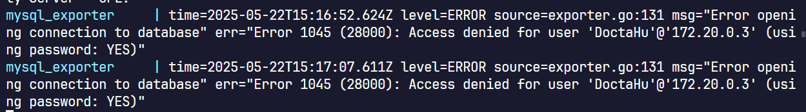
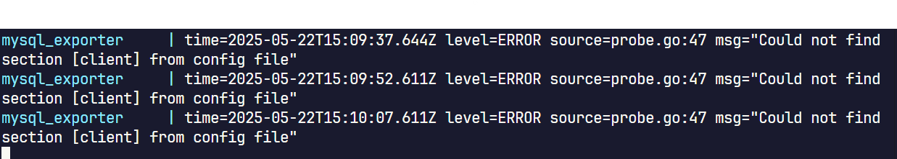
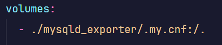
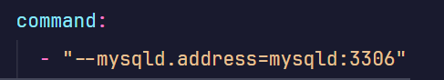

# Configure MySQL Exporter to Integrate Prometheus

## Introduction

To let integrate Prometheus with MySQL exporter, you have to preconfigure a few things before Prometheus can health check MySQL exporter.

This page will show you what to preconfigure MySQL exporter so that Prometheus can start working with it.

## Procedures

### 1. Create a SQL user

To allow MySQL exporter to scrape metrics from MySQL instance, you have to create an user with permissions to read all databases, see all threads and processes running on the server, and query replication-related inforamtion.

You run the following script in MySQL instance:

```mysql
CREATE USER '<username>'@'%' IDENTIFIED BY '<password>' WITH MAX_USER_CONNECTIONS 3;
GRANT PROCESS, REPLICATION CLIENT, SELECT ON *.* TO '<username>'@'%';
FLUSH PRIVILEGES;
```

When MySQL exporter first probe MySQL, it uses the user but with IP from the exporter's container to authenticate MySQL server. That means somehow MySQL exporter uses its own IP hardcodedly. Even Docker Compose cannot resolve the container's service name into IP. So, the `%` is applied to allow the user to be used from all hosts.



### 2. Prepare a .my.cnf file

MySQL exporter uses a configuration file named `.my.cnf` to define credentials for each target. Each target is defined as **auth_module** in `.my.cnf`.

Inside the file should look like this.

```.my.cnf
    [client]
    user = foo
    password = foo123
    [client.servers]
    user = bar
    password = bar123
```

The parent auth module has to be named `client`. For unknown reason, when Prometheus health check MySQL exporter wtih `.my.cnf` configured, Prometheus is unable to verify the exporter's health if the auth module isn't `client`.



### 3. Configure Prometheus configuration file

Let's go to `scrape_configs` section in Prometheus config file. You will need to add this code block.

```yaml
- job_name: "mysql_exporter"
    metrics_path: /probe
    params:
      target: ['mysqld:3306']
    static_configs:
        - targets: ["mysql_exporter:9104"]
```

You need to assign `metrics_path` attribute to `/probe` because by default MySQL exporter exposed its metrics using `/probe` path.

Also you have to add the `target` line to attribute `params` because this is the full endpoint to query metrics of a MySQL server from the MySQL exporter.

```text
http://<mysql-exporter-hostname-or-ip>:9104/probe?target=<mysql-hostname-or-ip>:3306&auth_mode=<auth mode>
```

Long story short, because MySQL exporter exposes metrics of a single MySQL server via the endpoint above, you have to add the same params to Prometheus job. However, `auth_mode` param can be obmitted if its value is `client`.

### 4. Configure Docker Compose file

After configuring all config file for each service, you now jump to Docker Compose file to add other configs to the containers.

You need to focus mainly on the exporter service. To configure it, you first need to create a volume mount and mount the MySQL exporter's config file into the **root** path of MySQL exporter container.



Next, you need to configure the MySQL host and its port via a parameter.



In case you find a document online saying add the environment variable `DATA_SOURCE_NAME` as a connection string to MySQL server, it won't work because MySQL exporter has alread deprecate this feature and it ignores the variable silently.
